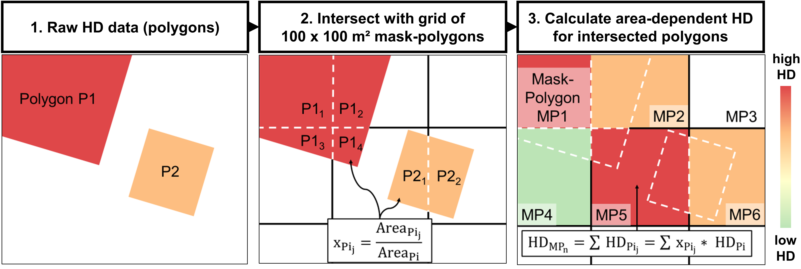

# PyHeatDemand - Processing Tool for Heat Demand Data

# Overview 
Knowledge about the heat demand (MWh/area/year) of a respective building, district, city, state, country or even on a 
continental scale is crucial for an adequate heat demand planning or planning for providing power plant capacities.

**PyHeatDemand** is a Python library for processing spatial data containing local, regional or even national heat demand 
data. The heat demand data can be provided as Raster, gridded polygon Shapefile, building footprint polygons Shapefile, 
street network linestring Shapefile, point Shapefiles representing the heat demand of a single building or an 
administrative area, and lastly postal addresses provided as CSV files.  

The package is a continuation of the results of Herbst et al., (2021) within the 
[Interreg NWE project DGE Rollout, NWE 892](http://www.nweurope.eu/DGE-Rollout). E. Herbst and E. Khashfe compiled the 
original heat demand map as part of their respective master thesis project at RWTH Aachen University. The final heat 
demand map is also accessible within the [DGE Rollout Webviewer](https://data.geus.dk/egdi/?mapname=dgerolloutwebtool#baslay=baseMapGEUS&extent=39620,-1581250,8465360,8046630&layers=dge_heat_final).

## Documentation
A documentation page illustrating the functionality of PyHeatDemand is available at https://pyhd.readthedocs.io/en/latest/. 

It also features installation instructions (also see below), tutorials on how to calculate heat demands, and the API Reference. 

## Installation  

PyHeatDemand is supported for Python version 3.10 and younger. Previous versions are officially not supported.
It is recommended to create a new virtual environment using the [Anaconda Distribution](https://www.anaconda.com/download) before using PyHeatDemand.
The main dependencies of PyHeatDemand are [GeoPandas](https://geopandas.org/en/stable/>) and [Rasterio](https://rasterio.readthedocs.io/en/stable/) for the vector data and raster data processing, [Matplotlib](https://matplotlib.org/) for plotting,
[GeoPy](https://geopy.readthedocs.io/en/stable/) for extracting coordinates from addresses, [OSMnx](https://osmnx.readthedocs.io/en/stable/) for getting [OpenStreet Maps](https://www.openstreetmap.org/#map=6/51.330/10.453) building footprints from coordinates,
[Rasterstats](https://pythonhosted.org/rasterstats/) for analyzing the resulting heat demand maps and more secondary dependencies like [Pandas](https://pandas.pydata.org/), [NumPy](https://numpy.org/), [Shapely](https://shapely.readthedocs.io/en/stable/manual.html), etc.

### Installation via PyPi 

**PyHeatDemand** can be installed via [PyPi](https://pypi.org/) using:

`pip install pyheatdemand`

### Installation via Anaconda 

**PyHeatDemand** is also available from [conda-forge](https://conda-forge.org/):

`conda install -c conda-forge pyheatdemand`

### Installation using YML-file

It is recommended to use the provided [environment.yml](https://github.com/AlexanderJuestel/pyheatdemand/blob/main/environment.yml) to ensure that all dependencies are installed correctly:

`conda env create -f environment.yml` 

Make sure that you have downloaded the environment file in that case.

### Forking or cloning the repository

The PyHeatDemand repository can be forked or cloned from https://github.com/AlexanderJuestel/pyheatdemand:

`git clone https://github.com/AlexanderJuestel/pyheatdemand.git`

A list of [requirements.txt](https://github.com/AlexanderJuestel/pyheatdemand/blob/main/requirements.txt) and an [environment.yml](https://github.com/AlexanderJuestel/pyheatdemand/blob/main/environment.yml) provide a list of all necessary dependencies to run PyHeatDemand from source.

## General Workflow

The general workflow involves creating a global mask of quadratic polygons (e.g. 10 km x 10 km) covering the entire 
studied area. This is especially used for larger areas such as states, countries or the Interreg NWE region to subdivide 
the area into smaller areas. Depending on the size of the input heat demand data, the corresponding underlying global 
mask polygons are selected and the final (e.g. 100 m x 100 m) resolution polygon grid is created. This grid including 
the input heat demand data is need to calculate the final heat demand map. 

The actual heat demand data is divided into four categories or data categories:
* Data Category 1: Heat demand raster data or gridded polygon (vector) data, different scales possible
* Data Category 2: Heat demand data as vector data; building footprints as polygons, street network as linestrings, 
single houses as points
* Data Category 3: Heat demand as points representative for an administrative area
* Data Category 4: Other forms of Heat Demand data such as addresses with assciated heat demand or heat demand provided
as usage of other fuels, e.g. gas demand, biomass demand etc.

Processing steps for Data Types 1 + 2

Processing steps for Data Types 3

## Continuous Integration
A CI is present to test the current code. It can be initiated using `pytest --cov` within the `test` folder. After 
running the tests, `coverage report -m` can be executed to get an report on the coverage and which lines are not covered
by the tests.

## API Reference
For creating the API reference, navigate to the `docs` folder and execute `sphinx-apidoc -o source/ ../pyheatdemand`.

## References

Jüstel, A., Humm, E., Herbst, E., Strozyk, F., Kukla, P., Bracke, R., 2024. Unveiling the Spatial Distribution of Heat 
Demand in North-West-Europe Compiled with National Heat Consumption Data. Energies, 17 (2), 481, 
https://doi.org/10.3390/en17020481. 

Herbst, E., Khashfe, E., Jüstel, A., Strozyk, F. & Kukla, P., 2021. A Heat Demand Map of North-West Europe – its impact 
on supply areas and identification of potential production areas for deep geothermal energy. GeoKarlsruhe 2021, 
http://dx.doi.org/10.48380/dggv-j2wj-nk88. 
